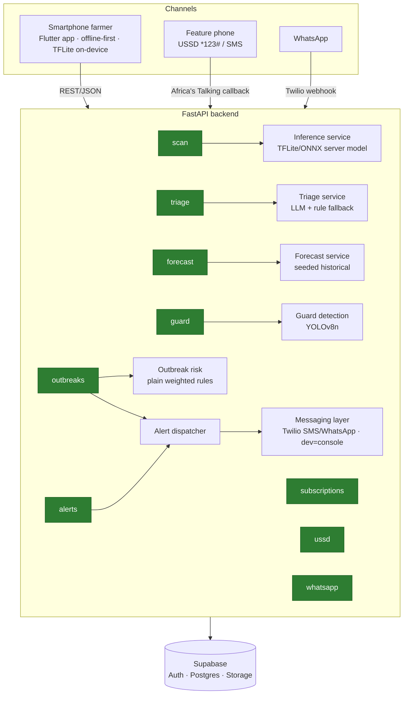

# RimaAI Architecture

RimaAI is a single, multi-channel AI farming companion. Smartphone farmers use
the offline-first Flutter app; feature-phone farmers use USSD/SMS; commercial
farmers additionally get the Guard surveillance module. Everything is served by
one FastAPI backend over a Supabase/Postgres datastore.

## System diagram

## Key design decisions

### Offline-first
Disease scans run on-device via a quantized MobileNetV3 TFLite model, so they
work with **zero connectivity**. Results are cached locally and sync to
`scan_history` when a connection returns. The server `/scan` endpoint is a
*fallback* only, for low-end devices that cannot run TFLite.

### Multi-channel by design
The alert dispatcher is channel-agnostic: it resolves subscribers from the
database and hands messages to a pluggable messaging layer. The same alert can
go out over SMS or WhatsApp. USSD is pull-based and handled by a stateless
menu-tree endpoint that reads the accumulated `text` field (Africa's Talking
callback format); WhatsApp is inbound-driven too, but one message at a time
(Twilio webhook format), so the same numbered-menu flow is served from a small
in-memory per-phone state machine instead.

### Where AI is / isn't used
| Component | AI? | Technique |
|-----------|-----|-----------|
| Crop/livestock disease scan | ✅ | CNN image classification (MobileNetV3) |
| Livestock triage | ✅ | LLM w/ transparent rule-based fallback |
| Forecast | ✅ (roadmap) | Time-series over MSD + satellite data (seeded stub today) |
| Guard intrusion detection | ✅ | Object detection (YOLOv8n) — class-aware, not motion pixels |
| Subscriptions / alert scheduling | ❌ | Plain CRUD + rules |
| **Outbreak risk aggregation** | ❌ | **Plain weighted rules** (count × recency × trust) |

Outbreak *spread prediction* is a deliberate future ML use case, unlocked once
real report volume exists — see `dataset_statement.md`.

### Data model (summary)
`regions`, `farmers`, `subscriptions`, `alerts`, `scan_history`, `guard_events`,
`outbreak_reports`, `district_risk`. Full DDL with Row Level Security in
[`../sample_data/schema.sql`](../sample_data/schema.sql).

### Community early-warning loop
`outbreak_reports` → per-district risk recomputed on every submission → when a
district crosses the high-risk threshold, a region-targeted disease alert is
auto-dispatched to subscribers. Crowdsourced reports thus close the loop back
into the alerts system.
